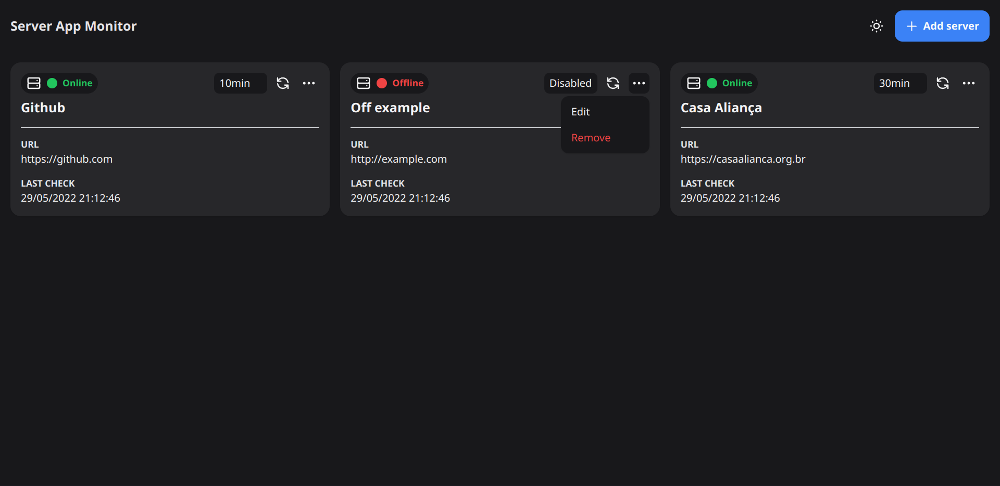
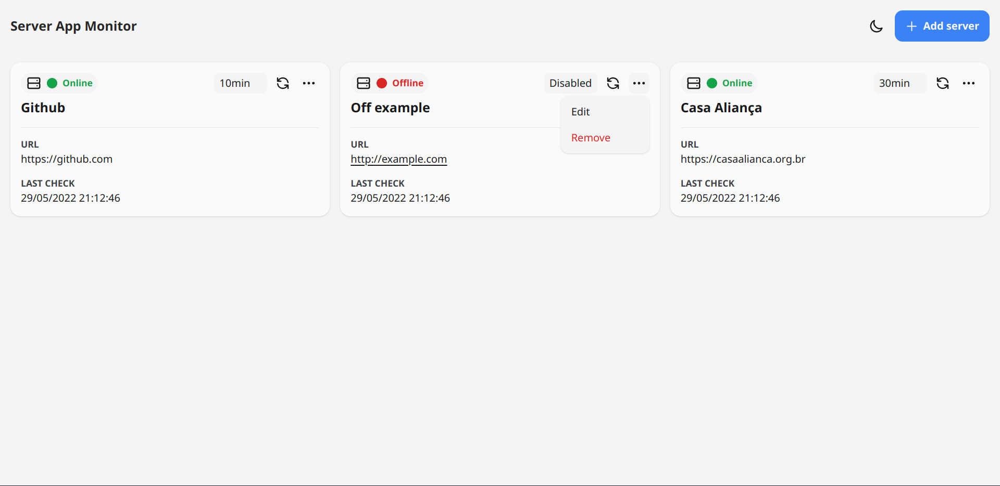

# 🖥️ Server App Monitor

Monit your server apps in one place!

## 👀 Preview




## ☑️ Features

- Progressive Web Application (PWA)
- Desktop notification when server is off-line
- Custom check interval
- Dark and light themes
- Persists the data after page reloads (data are saved in Local Storage)

## ⚠️ Limitations

- When this project is hosted over HTTPS, only HTTPS links can be checked

## 🔧 Main technologies used

- [TypeScript](https://www.typescriptlang.org)
- [ReactJS](https://reactjs.org)
- [TailwindCSS](https://tailwindcss.com)
- [Vite](https://vitejs.dev)
- [Vite Plugin PWA](https://vite-plugin-pwa.netlify.app)

## ⚙️ How to run this project

> You need to have [Git](https://git-scm.com) and [Node.js](https://nodejs.org) installed.

```sh
git clone https://github.com/DarkTechLC/server-app-monit.git
```

```sh
cd server-app-monit
```

```sh
npm install
```

### Development mode

```sh
npm run dev
```

### Production mode

```sh
npm run build
```

```sh
npm run start
```

## ⚖ License

This project is under the [MIT license](./LICENSE.md).
